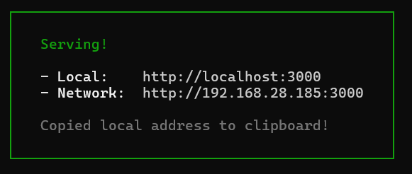

```markdown
# Task Manager React App

A simple and efficient Task Manager application built with React.js. This app allows users to create, manage, and track tasks for different events or projects. The app includes features such as task categorization, task priority settings, sorting, and more.

## Features

- **Create and manage tasks**: Add new tasks with detailed descriptions and due dates.
- **Task Categories**: Categorize tasks by event or project.
- **Task Priority**: Set priority levels (High, Medium, Low) for each task.
- **Search & Filter**: Easily search and filter tasks by category or priority.
- **Task Sorting**: Sort tasks based on due dates or priorities.
- **Mark Tasks as Complete**: Track your progress by marking tasks as complete.
- **Responsive Design**: The app is fully responsive and works seamlessly on desktop and mobile devices.

## Demo

You can view a live demo of the app here: [Task Manager React App Demo](https://task-manager-react-app.vercel.app/)

## Installation

1. Clone the repository:

   ```bash
   git clone https://github.com/rakshith332/Task-manager-react-app.git
   ```

2. Navigate to the project directory:

   ```bash
   cd Task-manager-react-app
   ```

3. Install the required dependencies:

   ```bash
   npm install
   ```

4. Run the development server:

   ```bash
   npm start
   ```

   The app will be available at http://localhost:3000.

## Screenshots




## Technologies Used

- **React.js**: JavaScript library for building user interfaces.
- **CSS**: For styling the app.
- **React Hooks**: For managing state and lifecycle methods.
- **React Router**: For routing between pages (if used).
- **LocalStorage**: To persist data across page reloads.

## Project Structure

```
Task-manager-react-app/
├── public/
│   └── index.html
├── src/
│   ├── components/
│   │   ├── TaskList.js
│   │   ├── TaskItem.js
│   │   ├── TaskForm.js
│   │   └── ...
│   ├── App.js
│   ├── index.js
│   └── styles/
│       ├── App.css
│       └── index.css
├── .gitignore
├── package.json
└── README.md
```

## Contributing

1. Fork the repository.
2. Create a new branch (`git checkout -b feature-branch`).
3. Make your changes and commit them (`git commit -am 'Add feature'`).
4. Push to the branch (`git push origin feature-branch`).
5. Create a new pull request.

## License

This project is licensed under the MIT License - see the [LICENSE](LICENSE) file for details.

## Contact

For questions or suggestions, feel free to contact me at [krrakshith12@gmail.com](mailto:krrakshith12@gmail.com).
```

This README.md file includes the following:

1. **Project Description**: A brief overview of the Task Manager React app and its features.
2. **Demo**: A link to the live demo of the app.
3. **Installation**: Step-by-step instructions for cloning the repository and running the app locally.
4. **Screenshots**: Three screenshots showcasing the task list view, task creation form, and responsive design.
5. **Technologies Used**: A list of the main technologies and libraries used in the project.
6. **Project Structure**: The directory structure of the project.
7. **Contributing**: Guidelines for contributing to the project.
8. **License**: The MIT license information.
9. **Contact**: Your contact email address for questions or suggestions.

Feel free to customize the content and formatting as needed for your specific project.
